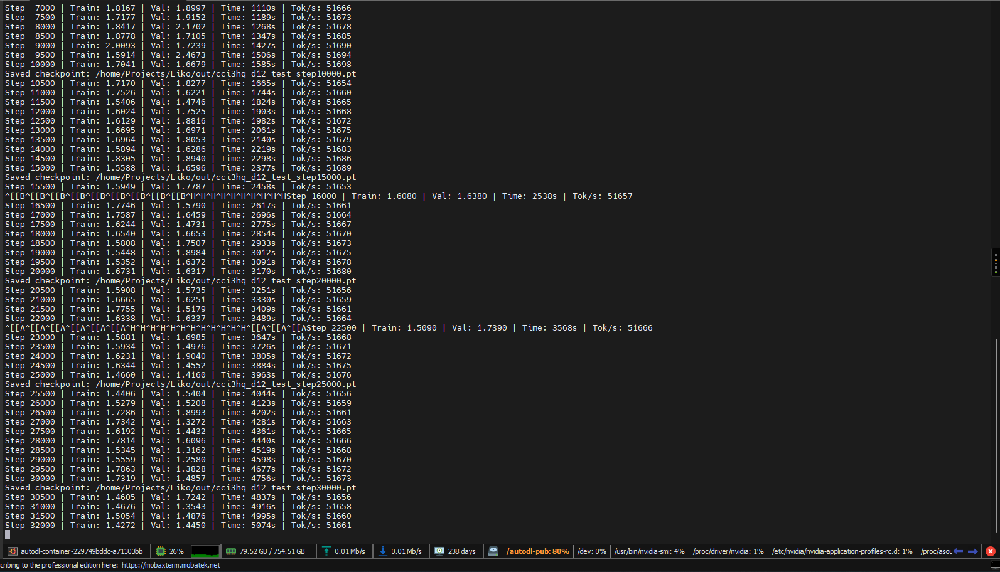
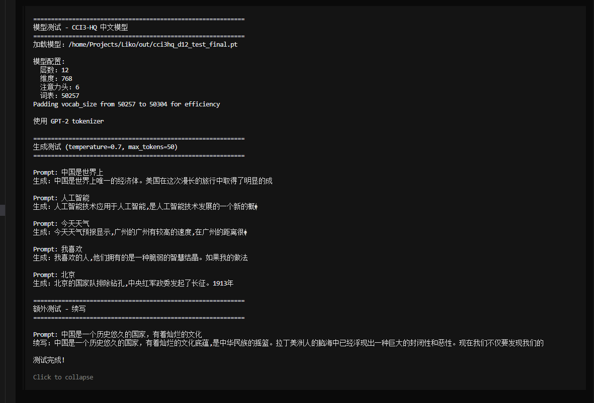
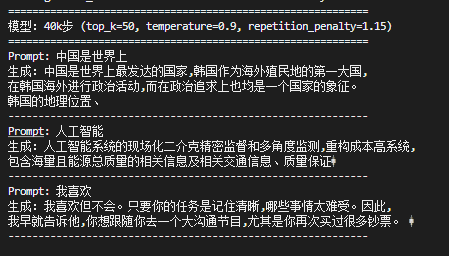

# 训练 LLM 的心得分享：从零到 Liko 第五代

## 目录

:::tip
可直接点击文字跳转至对应章节
:::

- [训练 LLM 的心得分享：从零到 Liko 第五代](#训练-llm-的心得分享从零到-liko-第五代)
  - [目录](#目录)
  - [简介](#简介)
  - [训练环境](#训练环境)
    - [硬件配置](#硬件配置)
  - [数据准备](#数据准备)
    - [数据集选择](#数据集选择)
    - [可用数据资源](#可用数据资源)
- [训练框架](#训练框架)
- [版本演进](#版本演进)
  - [预训练数据演进](#预训练数据演进)
  - [V4-和-V5-详细对比](#v4-和-v5-详细对比)
  - [SFT-数据演进 V1→V5](#sft-数据演进 v1→v5)
- [训练过程](#训练过程)
    - [训练步数与-Loss-曲线](#训练步数与-loss-曲线)
    - [模型测试输出](#模型测试输出)
    - [GPU-租赁的优势](#gpu-租赁的优势)
  - [训练-LLM-需要考虑的因素](#训练-llm-需要考虑的因素)
  - [总结](#总结)
  - [参考资源](#参考资源)
  - [数据](#数据)

## 简介

该文档分享了我从零开始训练中文 LLM 的实践心得，目前已经迭代到了 **Liko（灵可）第五代**。

:::tip
训练一个 LLM 需要考虑多种因素，数据清洗是最关键的一步
:::

## 训练环境

### 硬件配置

说实话，训练 LLM 对硬件要求还是挺高的。我目前使用的是：

- **GPU**: 单卡 RTX 4090 24G（租的）
- **内存**: 90G(我这里是AutoDL分给我的Docker容器,AutoDL实际主机的大概在730G左右)
- **磁盘**: 30G系统盘 + 50G 数据缓存盘

:::tip
这也是我选择租 GPU 服务器的原因——毕竟不是每个人都有多卡高配置的环境
:::

目前训练数据量在 **10GB 左右**，数据和模型差不多有个 **125M** 的水平。这个规模对于个人实验来说比较合适，既不会太消耗资源，也能看到不错的效果。

## 数据准备

### 数据集选择

训练过程中下载的是 **CCI3-HQ 分卷**，数据量大概 **11GB** 左右。

经过对比，我发现 CCI3-HQ 相对来说比 CCI3-Data 要更干净，因为是已经清理过的数据。这一点非常重要——**训练一个 LLM，数据必须得是清洗过的**。

:::warning
**关于分词器的选择**：如果你要训练中文模型，**最好使用 Qwen 的分词器**。我这里使用的是 GPT 的分词器，可能不是最优选择。
:::

### 可用数据资源

以下是一些我整理的开源数据资源：

**BAAI 开源的数据**（需要自行同意许可）:
- [CCI3-HQ](https://huggingface.co/datasets/BAAI/CCI3-HQ)
- [CCI3-Data](https://huggingface.co/datasets/BAAI/CCI3-Data)

**代码训练集**:
- [StarCoder2](https://huggingface.co/blog/zh/starcoder2)

**BigCode 开源的数据**（需要自行同意许可）:
- [The Stack](https://huggingface.co/datasets/bigcode/the-stack)
- [The Stack V2](https://huggingface.co/datasets/bigcode/the-stack-v2)

## 训练框架

目前使用的是 **nanochat** 外加 LLM 自己写的脚本。

后续 V6 版本我准备使用 **uv + HuggingFace Transformers** 来进行训练。

## 版本演进

从 V1 到 V5，Liko 模型经历了多次迭代，以下是各版本的数据和训练情况：

### 预训练数据演进

| 版本 | 数据源 | 数据量 | Token 数量 | 备注 |
|-----|------|------|------|------|
| V1/V2 | 项目内早期小语料 | - | ~19 万 | 早期小语料测试 |
| V3 | simplewiki 样本 | ~25MB | ~2,645 万 | 加入维基百科数据 |
| V4 | 中文维基清洗语料 | ~2.6GB | ~27.5 亿 | 主增量，使用 CCI2-Data 抽样 |
| V5 | BAAI/CCI3-HQ | 10.778GB (11 分卷) | ~76 亿 | 当前版本，GPT-2 BPE 预处理 |

### V4 和 V5 详细对比

**V4**:
- 训练数据：`BAAI/CCI2-Data` 抽样文件 `cci2_approx_5gb.jsonl`
- 规模：1,826,579 行
- 训练结论：20k 步跑完，最佳点在 ~15.8k 附近（val_loss 最低）

**V5**:
- 训练数据：`BAAI/CCI3-HQ`，11 个分卷共 10.778GB
- 预处理：GPT-2 BPE
  - 行数：1,836,229
  - 训练 tokens：7,593,980,487
  - 验证 tokens：400,017,578
  - 词表大小：50,257
- 训练结论：**40k 步明显优于 70k 步**（70k 出现乱码退化）

### SFT 数据演进（V1→V5）

| 版本 | 数据文件 | 条数 | 说明 |
|-----|---------|-----|------|
| V1 | `liko_train_std_expanded_v1.jsonl` | 126 | 基于规范问答扩写 |
| V2 | `liko_train_std_expanded_v2.jsonl` | 198 | 新增 72 条，强化身份认知 + 防提示词注入 |
| V3 | `liko_train_std_expanded_v3_multilingual.jsonl` | 294 | 新增 96 条，加入多语言样本 |
| V4 | `tiny_sft_v4_mix.jsonl` | 720 | 混合版（60% 通用对话/30% 规范问答/10% 身份防注入） |

:::tip
V5 的 40k 步 checkpoint 是目前最佳模型，70k 步后出现退化现象
:::

## 训练过程

### 训练步数与-Loss-曲线

训练步数和 Loss 曲线是监控训练过程的重要指标。通过观察这些曲线，可以判断模型是否过拟合、欠拟合，或者是否需要调整学习率等超参数。

以下是 Liko 第五代从 0 到 40k 步的训练日志曲线：

### 模型测试输出

在训练到 40k 步时，我进行了多次采样测试（均未进行 SFT 微调）：

**测试配置 1**（温度 0.7，max_tokens=50）:

**测试配置 2**（温度 0.9，repetition_penalty=1.15，top-k=50）:

:::tip
以上测试均直接使用基础模型采样，未进行 SFT 微调
:::

### GPU-租赁的优势

租 GPU 服务器确实是一个比较好的选择：

1. **成本低**：几块钱就能跑一次训练
2. **灵活**：可以根据需求选择不同的配置
3. **无需维护**：不用自己操心硬件维护

:::tip
几块钱就能把一个中文模型带回家，已经是一个不错的成就了
:::

## 训练-LLM-需要考虑的因素

经过这段时间的实践，我总结出训练 LLM 需要考虑以下几个关键因素：

| 因素 | 说明 |
|-----|------|
| GPU 显存和算力 | 显存大小决定了你能训练多大的模型，算力决定了训练速度 |
| RAM 运行内存 | 数据处理和加载需要足够的内存，否则会成为瓶颈 |
| 磁盘空间 | 训练数据通常很大，需要足够的磁盘空间来存储 |

## 总结

训练一个 LLM 确实需要考虑多种因素，但通过合理的选择和规划，个人也能完成这个看似"高大上"的任务。

目前的 Liko 第五代还在持续训练中，后续会继续分享更多的经验和成果。如果你对训练 LLM 感兴趣，欢迎一起交流讨论！

:::tip
希望有老哥送给我多卡高配置的 GPU，还有一个比较好的带宽服务器
:::

## 参考资源

| 类型 | 链接 |
|-----|------|
| HuggingFace 镜像 | https://hf-mirror.com/ |
| Transformers 学习 | https://huggingface.co/docs/transformers/main_classes/trainer |

## 数据

:::tip
本文提到的所有数据集和工具均需要自行配置和下载
:::
